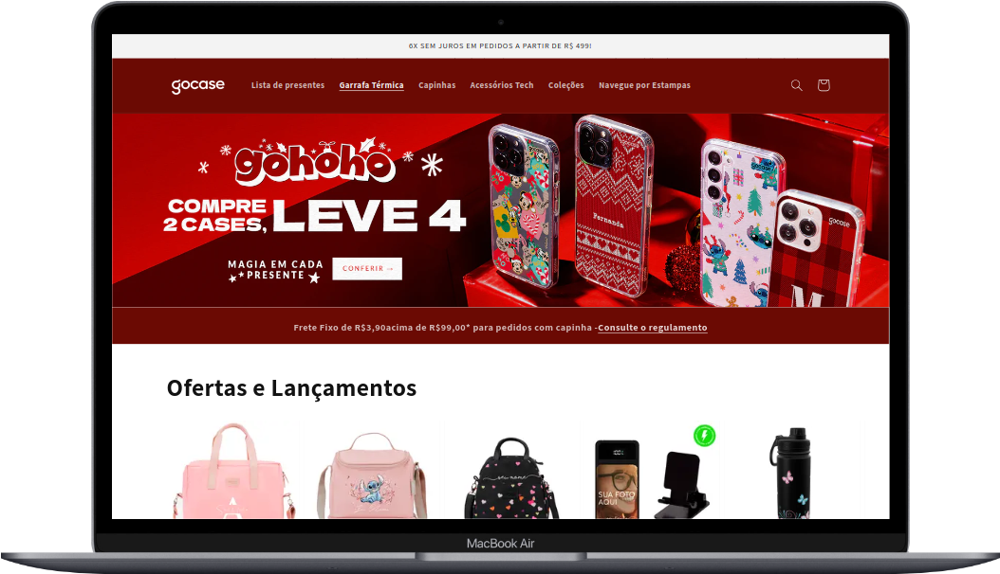
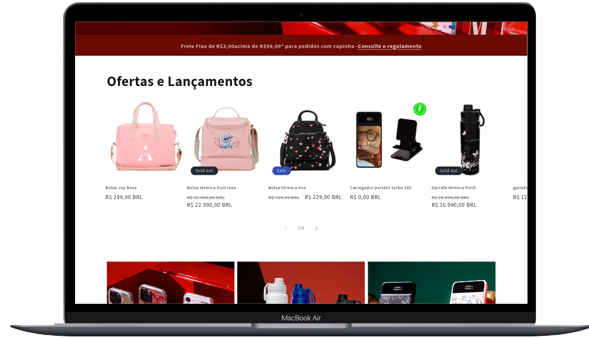
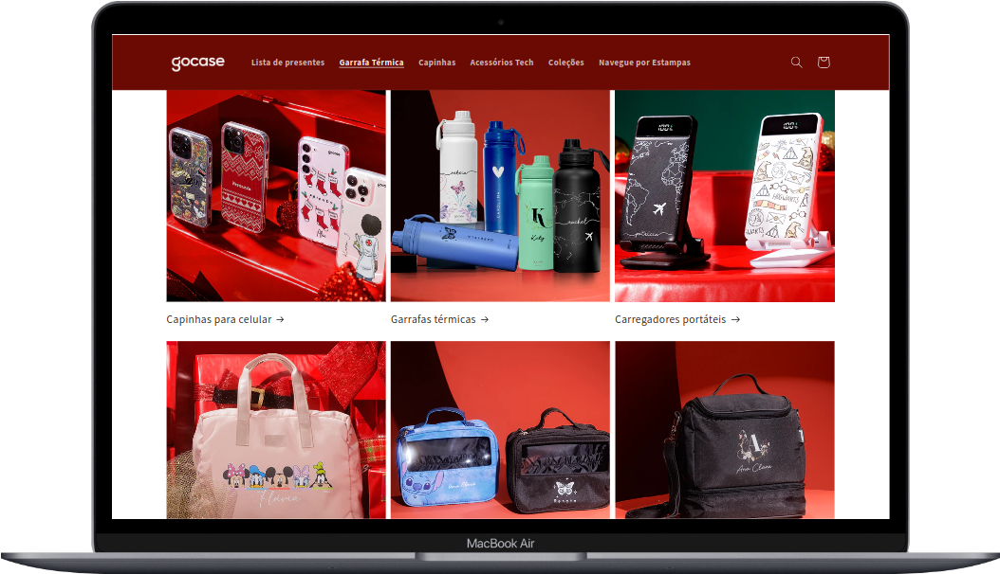
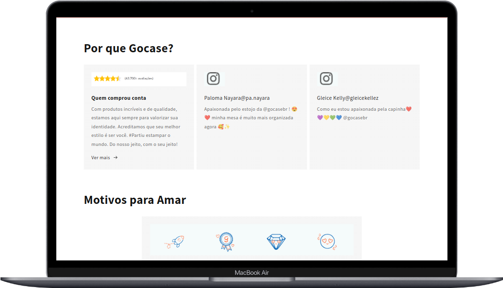
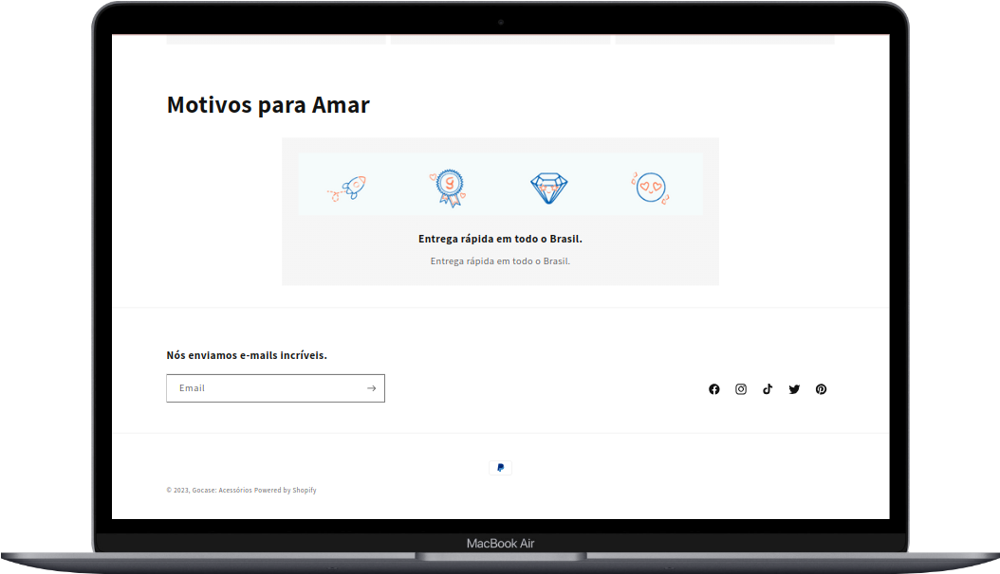
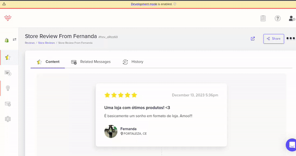
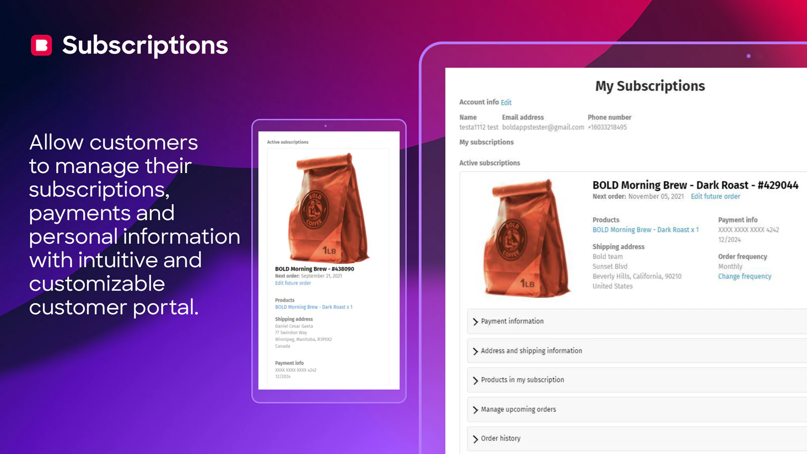

  <a href="#">
    
    

&nbsp;

# Gocase - Business case ✨✨

Repositório dedicado para documentar minha experiência durante a resolução do Business case para posição de Desenvolvedor Shopify da Gocase.

## Desafios

- Introdução [ver](#introdução-✨)
- Desafio 1: [ver](#desafio-1-✨)
- Desafio 2: [ver](#desafio-2-✨)
- Desafio 3: [ver](#desafio-3-✨)

## Introdução ✨

Aqui você vai encontrar minha resolução neste empolgante desafio que foi proposto. Algumas etapas foram bem desafiantes visto que é meu primeiro contato com essa tecnologia, foi muito divertido pesquisar e aprender coisas novas.

### Shopify

A [Shopify](https://shopify.com/) é uma empresa de comércio canadense com sede em Ottawa, Ontário, que desenvolve softwares de computadores para lojas online e sistemas de varejo de ponto de venda.

### Gocase

A [Gocase](https://www.gocase.com.br/) é uma lovebrand nativamente digital que desenvolve acessórios personalizados com estilo e excelente qualidade. A marca foi projetada e concebida por jovens empreendedores cansados de produtos sem criativade e que não promovem identicação.

### Business Case

Neste caso prático, eu recebi três desafios:

- O primeiro para testar conhecimeno em front-end.
- O segundo para testar habilidades em desenvolvimento full-stack.
- O terceiro avalia curiosidade, criatividade e habilidade para encontrar soluções inovadoras.

Até o momento que escrevo, não consegui completar os 3.

## A metodologia ✨

 Para resolver eu usei uma abordagem de resolução de problemas e desenvolvimento de software. Vale ressaltar que eu não possuia conhecimentos sobre o desafio proposto e precisei estudar para iniciar a aplicação, o que me fez demorar a iniciar aplicação prática em si. 
 
 Algumas etapas da minha resolução foram:

**1. Entendimento do problema**: Procurei entender os requisitos do negócio e os objetivos a serem alcançados. Identifiquei lagumas restriçẽos de início e uma delas foi o desafios técnico.

**2. Planejamento:** Dividi o problema em partes menores e mais gerenciáveis. Isso me ajudou a abordar cada desafio de forma mais eficaz.

**3. Escolha da metodologia de desenvolvimento:** Metodologias ágeis, usei um quadro Kanban, para lidar com organização e autogerenciamento.

**4. Implementação e Desenvolvimento:** A escolha das ferramentas adequadas para implementar a solução foi uma parte interessante do desafio. Nesta devolutiva não consegui entregar o meu habitual embora eu tenha prendido muito com a excelente documentação da shopify, pude observar alguns erros durante meu desenvolvimento. Alguns detalhes que precisavam de constantes paradas para pesquisa e estudo antes de continuar o desenvolvimento em si. Testes: Esse foi um ponto que não consegui achar e fiquei curiosa para saber se existem ferramentas que testam extensões dos app.

**5. Documentação:** A documentação consiste na escrita desde README mantendo registros detalhados do processo de desenvolvimento, incluindo decisões, problemas encontrados e soluções implementadas.

**6. Comunicação:** Minha ideia inicialmente seria me comunicar regularmente com as partes interessadas para garantir que a solução proposta atendesse às expectativas do negócio. Porém alguns fatores limitantes me desviaram desse plano inicial e não segui com essa ideia, e isso nunca é interessante principalmente no dia a dia trabalhando mas considerei como parte do desafio pesquisar por conta própria.

**Ferramentas úteis:**
- Controle de versão: Git.
- Ambientes de Desenvolvimento Integrado -(IDEs): Visual Studio Code.
- Plataformas de Gerenciamento de Projetos: - Trello.
- Ambiente de criação de loja: Shopify.
- outros: liquid, npm, node, react, apps da loja shopify.

## Desafio 1 ✨

**Desafio 1: Front-end - Personalização de um tema na loja Shopify.**
Esse desafio incluia a criação de uma conta Shopify Partners, criação de uma loja de desenvolvimento seguindo as instruçẽos na [Shopify Development Stores](https://help.shopify.com/en/partners/dashboard/managing-stores/development-stores).

Também estava incluido fazer uma modificação na página inicial do tema para ficar semelhante ao site da Gocase. Na própria shopify existe um recurso para fazer algumas modificações simpes no-code, porém eram muito limitas e optei por baixar o tema e fazer algumas modificações simples localmente para em seguida publicar novamente o tema e a loja. Nesse passo foi necessário fazer download do kit de desenvolvimento e também foi utilizado o app Theme Access para fazer autenticação por email.

**Bônus (opcional):**

1. ✅ Faça o deploy do seu tema no Github. [Ver aqui]()
2.  Implemente integração contínua com o Github.
3.  Utilize o Shopify-CLI no seu processo.

✅ **loja:** https://gocaseapp.myshopify.com/

✅ **preview:** https://k16ohw4tkmo6eg84-84455129367.shopifypreview.com

**Veja abaixo a demonstração da loja:**

#### ✅ Desktop

    

 

#### ✅ Mobile e Tablet

<table>
<tr>
<td align="center"> <b>Versão 1.0</b></a> 
	Mobile
</td>
<td align="center"> <b>Versão 1.0</b></a> 
Tablet
</td>
</tr>
</table>

(<a href="#readme-top">Voltar ao topo</a>)

### ✅ Seções

    
       

 

    
       

 

    
       

## Desafio 2 ✨

Desafio 2 - Crie um software para interagir com a Shopify:
 1. Desenvolva uma aplicação front-end para visualização e interação com
dados da Shopify.
 2. Faça o deploy da aplicação para acesso público.

Gerenciamento de Pedidos e Faturamento:
 1. Crie um recurso para acessar, listar e modificar pedidos da sua loja Shopify.
Inclua funções para deletar pedidos e modificar dados do cliente.
 2. Implemente análises de métricas como quantidade de pedidos, ticket médio e
faturamento total.

(<a href="#readme-top">Voltar ao topo</a>)

## Desafio 3 ✨
### Case de Negócio - Seleção de Aplicativos para Shopify
**Desafio 3 - Perguntas Adicionais:**

✅ 1. Com um orçamento de $100 por mês e um volume de 10.000 pedidos, qual
   aplicativo de avaliação de clientes você recomendaria para uma loja Shopify e
   por quê?

✅ 2. Liste 3 aplicativos para modificar o painel de edição do usuário na Shopify e
   explique qual você escolheria e por quê.

### Objetivo
Esta seção apresenta a pesquisa, análise e seleção de aplicativos para avaliação de clientes e modificação do painel do usuário na plataforma Shopify, considerando um orçamento de $100 por mês e um volume de 10.000 pedidos. O objetivo é fornecer uma solução inovadora e criativa para atender às necessidades da empresa.

O processo de seleção de aplicativos foi pensando de formar a atender às necessidades específicas da empresa no contexto da plataforma Shopify. As etapas de pesquisa, critérios de avaliação e escolha dos aplicativos são descritas de forma a apresentar uma solução completa e alinhada com as expectativas da empresa.

### Metodologia
Para a seleção dos aplicativos, foi realizada uma pesquisa detalhada na Shopify App Store, considerando critérios como funcionalidades oferecidas, compatibilidade com Shopify, facilidade de uso, análises, suporte ao clientes. A metodologia incluiu a análise comparativa dos aplicativos disponíveis e a aplicação de critérios inovadores e criativos na escolha final, como  integração com tecnologias emergentes (IA, RA) para análise de sentimentos ou experiências visuais únicas para revisões de produtos.

## Aplicativos Selecionados
### Avaliação de Clientes:
[Fera Product Reviews App](https://apps.shopify.com/fera)

[Vídeo Demo](https://www.youtube.com/watch?v=N-GAARy_JF0)

(<a href="#readme-top">Voltar ao topo</a>)

### Demonstração Visual
#### Overview:

#### Atribuindo um review a um produto:

**Pontos positivos do app:**
- Importe avaliações do Google, Facebook, Trustpilot
- Faça com que os comentários sejam exibidos na Pesquisa Google e no Google Shopping
- Envie e-mails de solicitação de revisão automática
- Colete análises de produtos, fotos e vídeos
- Ofereça incentivos aos clientes para avaliações como
-Dinheiro de volta
- Pontos de fidelidade
- Descontos
- Use temas integrados impressionantes para exibir comentários
- Exiba avaliações em sua loja com avaliações de produtos, avaliações de lojas, selo de classificação média e widgets de mural de fotos/vídeos
- Agrupe produtos para simplificar a exibição de avaliações
- Personalização completa

**Contras das análises de produtos:**
- Número limitado de usuários administradores em planos inferiores
- Limite de solicitações de revisão e widgets no plano gratuito
- Somente planos superiores permitem personalização do desenvolvedor

Com um orçamento de US$ 99/mês temos limite de 20 widgets, 10.000 solicitações de revisão enviadas/mês, testes A/B, 5 usuários. Para uma empresa pequena e de médio porte seria suficiente, caso o volume de vendas aumente pode precisar de um plano mais robusto.

Com este app é possível fazer o setup em minutos, importar comentários existentes, solicitar avaliação de clientes e adicionar widgets de avaliação, classificação e foto com interface moderna.

### Modificação do Painel do Usuário:
1. [Bold Subscriptions:](link)
Esse aplicativo permite aos lojistas adicionar a funcionalidade de assinaturas para produtos. Embora não personalize diretamente o painel do usuário, ele oferece aos clientes a capacidade de gerenciar suas assinaturas por meio de seu próprio painel no site.
2. [ReCharge Payments](link)
Similar ao Bold Subscriptions, o ReCharge Payments permite a gestão de assinaturas de produtos. Ele oferece um painel onde os clientes podem gerenciar suas assinaturas e detalhes de pagamento.
3. [Customer Fields](link)
Esse aplicativo permite a adição de campos personalizados aos perfis dos clientes na loja Shopify. Embora não modifique diretamente o painel do usuário, ele permite coletar informações adicionais dos clientes e exibi-las em seus perfis.

A escolha de qual aplicativo usar depende das necessidades específicas de personalização do painel do usuário. E é perceptível as limitações de cada um dentro do escopo de personalização, o que requer um desenvolvedor nessa área, pois algumas alterações específicas podem exigir trabalho personalizado na plataforma Shopify.

#### App escolhido: Bold Subscriptions

 

Tendo em vista a análise realizada com os aplicativos acima eu escolheria o **Bold Subscriptions**, pois ele oferece a funcionalidade de gerenciamento de assinaturas de produtos para os clientes, permitindo que eles façam alterações, gerenciem ou cancelem suas assinaturas através de um painel dedicado no site.

Ao oferecer essa capacidade, você está fornecendo uma ferramenta útil para os clientes controlarem suas preferências de assinatura sem precisar entrar em contato com o suporte. Isso pode melhorar a satisfação do cliente, fornecendo-lhes autonomia e facilidade para fazer alterações conforme necessário.

#### Tendências futuras

Os aplicativos que escolhi se destacam por suas características únicas, e possuem interface inovadora. A minha perspectiva é que essem apps continuem evoluindo no seu desenvolvimento para se adaptar as futuras mudanças no meio do comérci eletrônico e em UX.

Notei um espaço que não é muito considerado, como integração com tecnologias emergentes como Ia e Realidade aumentada, essas tecnologias seriam úteis em vários aspectos, como oferecer uma exeriência visual única e fazer análise de sentimentos para recomendação de produtos. 

(<a href="#readme-top">Voltar ao topo</a>)

## Encerramento ✨

### Finalização e Agradecimentos

> ### A persistência é o caminho do êxito.
>
> Charles Chaplin

#### Apesar de não conseguir finalizar os 3 desafios completamente dentro do tempo estipulado, fiquei bem feliz em participar e conhecer ferramentas novas e bem diferentes do que estou habituada, foi muito divertido. Agradeço a Gocase por oferecer esta oportunidade de ampliar minha visão sobre as possibilidades de construção de extensões e apps para lojas virtuais.

🤔 Ficou com alguma dúvida? Vem conversar comigo!

  

💬<a href="https://github.com/fernandacostads#-contacts">Contato</a>💬

(<a href="#readme-top">Voltar ao topo</a>)

